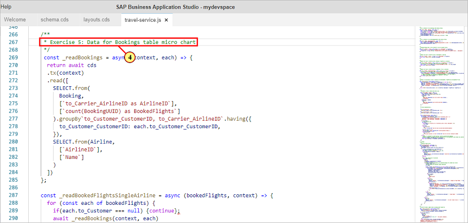
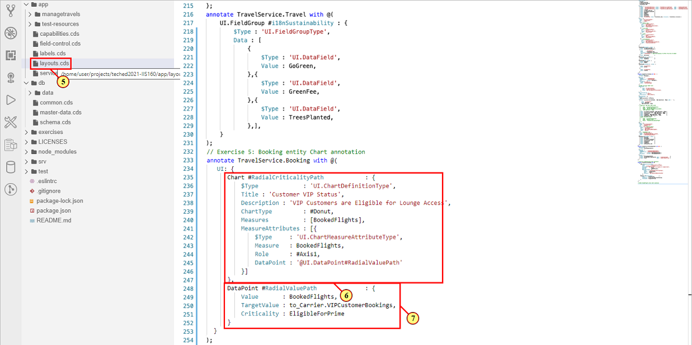
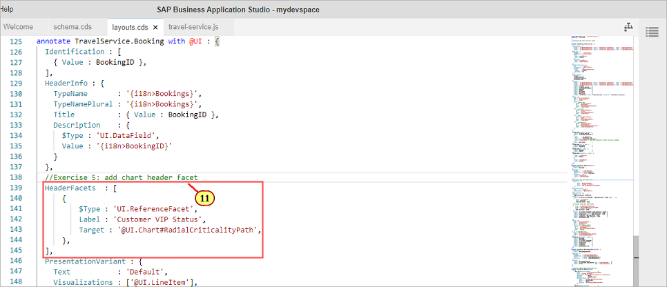

# Exercise 5 - Adding a Micro Chart to the Table Building Block

In this exercise, we will add a micro chart column to the **table building block**.\
The micro chart shall show the **Customer VIP Status** per booking, based on all cumulated bookings for the corresponding airline.\
While the **flexible programming model** offers the means to adding it by using the building block micro chart and a custom column fragment,\
the table **per standard** supports pure annotation based micro charts columns, which perfectly fits this use case.\
As a rule of thumb, **leveraging standard functionality** should always be the preferred way of enhancing the UI, using extensions should be\
the option of choice where the standard doesn't offer a certain functionality.\
You can find an example implementation for a [custom column](https://sapui5.hana.ondemand.com/test-resources/sap/fe/core/fpmExplorer/index.html#/customElements/customElementsOverview/customColumnContent) and the [building block micro chart](https://sapui5.hana.ondemand.com/test-resources/sap/fe/core/fpmExplorer/index.html#/buildingBlocks/microchart/microChartDefault) in the [Flexible Programming Model Explorer](https://sapui5.hana.ondemand.com/test-resources/sap/fe/core/fpmExplorer/index.html#/overview/introduction).

## Exercise 5.1 Add Annotations UI.Chart and UI.DataPoint

The data required for the micro chart are already provided in the service model in file **db/schema.cds** (1) as an extension to the **Booking** entity (2).


The properties are annotated with **@Core.Computed**, which means that the values are calculated in a read handler implementation for entity **Booking**
in file **srv/travel-service.js** (3), section **Exercise 5: Data for Bookings table micro chart** (4).




With the optional property **Criticality**, the coloring of the radial chart is defined.\
In order to add a micro chart to a table, you have to define an annotation of type **@UI.DataPoint**. Its mandatory properties are **value** and a **target value**.\
The data point needs to be referenced in the **measure attributes** of annotation **@UI.Chart**.\
Chart type **#Donut** displays a **radial chart**. Properties **Measures** and **MeasureAttributes** are mandatory.

\(5\) Open file **app/layouts.cds**.

Scroll down to section **Exercise 5: Booking entity Chart annotation** and add the following code snippet:

```js
annotate TravelService.Booking with @(
   UI: {
      Chart #RadialCriticalityPath            : {
          $Type             : 'UI.ChartDefinitionType',
          Title : 'Customer VIP Status',
          Description : 'VIP Customers are Eligible for Lounge Access',
          ChartType         : #Donut,
          Measures          : [BookedFlights],
          MeasureAttributes : [{
              $Type     : 'UI.ChartMeasureAttributeType',
              Measure   : BookedFlights,
              Role      : #Axis1,
              DataPoint : '@UI.DataPoint#RadialValuePath'
          }]
      },
      DataPoint #RadialValuePath              : {
          Value       : BookedFlights,
          TargetValue : to_Carrier.VIPCustomerBookings,
          Criticality : EligibleForPrime
      } 
  }
);
```

The screenshot shows annotations **@UI.Chart** (6) and **@UI.DataPoint** (7)



## Exercise 5.2 Enhance UI.LineItem Annotation via Code Completion

With annotation **@UI.Chart** in place, we will now add it to annotation **@UI.LineItem** of entity **Bookings**.\
For this, we will add a record of type **DataFieldForAnnotation**.\
In file **app/layouts.cds**, scroll to section **Exercise 5: add chart table column**.

\(8\) Trigger code completion by pressing ctrl+space and select .


The annotation is added along with its basic structural elements.\
(9) With the cursor inside the quotes ' ' of property **Target**, trigger code completion (ctrl+space) and select .


.

Use code completion to add property **Label** and put **Customer VIP Status** inside the quotes.

(10) Trigger code completion again in order to add inline annotation **![@UI.Importance] : #High**.


Annotation **@UI.Importance** makes sure that table columns are always displayed inline in case of small screen sizes.

The entered code snippet should match the following:
```js
     {
         $Type : 'UI.DataFieldForAnnotation',
         Target : '@UI.Chart#RadialCriticalityPath',
         Label : 'Customer VIP Status',
         ![@UI.Importance] : #High,
     },
```

## Exercise 5.3 Add Header Facet to Booking Supplements Page

We will now add the same chart as a header facet in  sub object page **Booking Supplements**.\
(11) In file **app/layouts.cds**, scroll to section **Exercise 5: add chart header facet**.



You can use code completion to add the following code snippet as shown in the above screenshot:

```js
  HeaderFacets  : [
      {
          $Type : 'UI.ReferenceFacet',
          Target : '@UI.Chart#RadialCriticalityPath',
          Label : 'Customer VIP Status'
      },
  ],
```

Switch to the preview browser tab.\
(12) On the Object Page, the table now shows the micro chart column.\
(13) Click on a table line in order to navigate to the bookings supplement page.


\(14\) The sub object page header now shows the same micro chart.


## Summary

We've now successfully added a **chart annotation** to the service and added a **micro chart column** to the table\
and a **micro chart header facet** to the sub object page.

Continue to - [Exercise 6 - Flexible Programming Model:Using the Chart Building Block](../ex6/README.md)